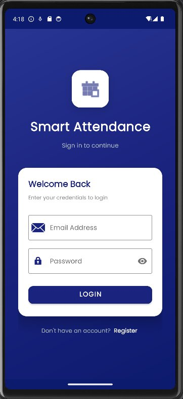
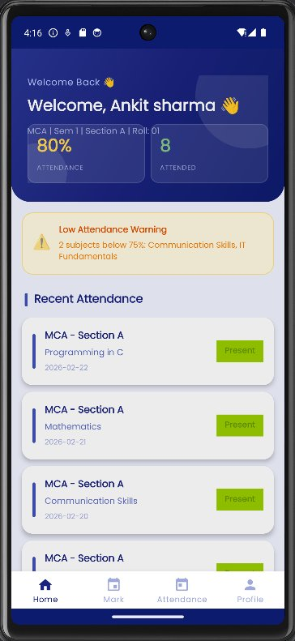
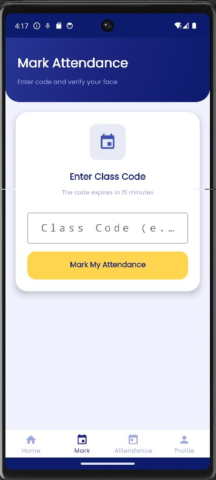
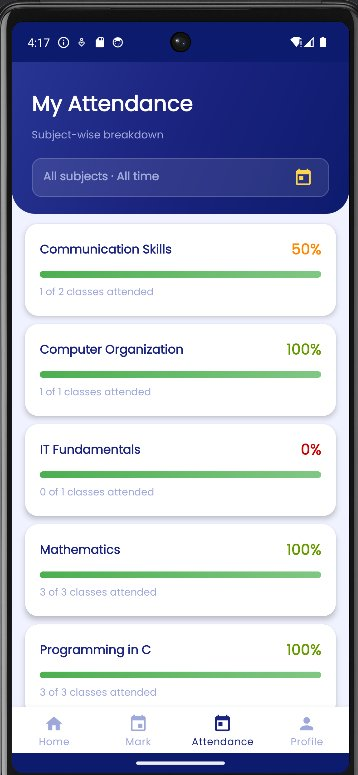
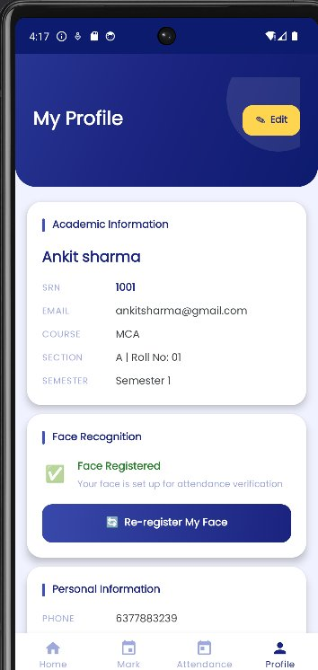
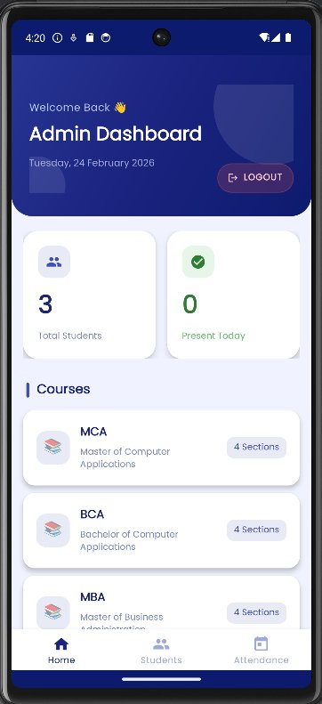
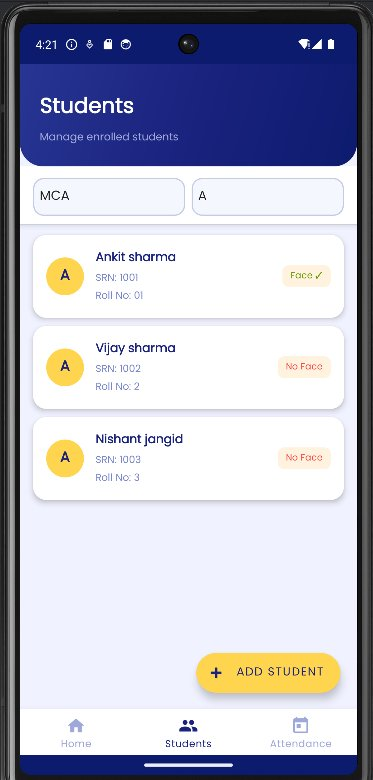
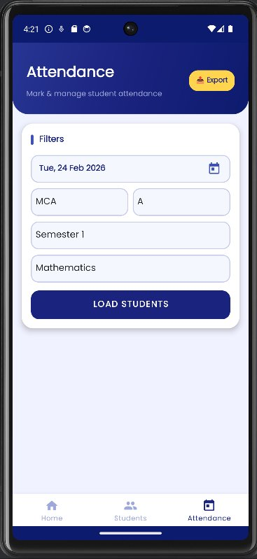

<div align="center">



# Smart Attendance Monitoring System

### AI-Powered Attendance Management for Android

<p>
  
  
  
  
  
</p>

A full-stack Android attendance system that combines **session-code verification** with **on-device face recognition** to completely eliminate proxy attendance — built for colleges and educational institutions.

**No face images ever leave the device. All ML inference runs locally.**

</div>

---

## 📸 Screenshots

### 🎓 Student App

<div align="center">

| Login | Home | Mark Attendance | My Attendance | Profile |
|-------|------|----------------|---------------|---------|
|  |  |  |  |  |
| Email + password auth | Overall % · warnings · recent feed | Enter 6-char code → face verify | Subject-wise % · progress bars | Face status · academic info |

</div>

### 👨‍🏫 Admin App

<div align="center">

| Dashboard | Students | Attendance |
|-----------|----------|------------|
|  |  |  |
| Stats · courses · low-attendance alerts | Roster with face-status badges | Filters · session · manual mark · export |

</div>

---

## ✨ Features

### 🎓 Student

| Feature | Description |
|---------|-------------|
| **Home Dashboard** | Overall attendance %, total classes attended, low-attendance subject warning, recent attendance feed |
| **Mark Attendance** | Enter teacher's 6-char session code → camera opens → face verified on-device → attendance written to Firestore |
| **Attendance History** | Subject-wise breakdown with color-coded progress bars (🟢 ≥75% · 🟡 60–74% · 🔴 <60%), filterable by date |
| **Overall Summary Card** | Aggregated % across all subjects with large progress bar, warning banner if below 75% |
| **Face Registration** | 5-frame capture with strict quality gates → embeddings averaged → stored in Firestore |
| **Face Re-registration** | Update face at any time; old embedding auto-deleted before new one is saved |
| **Profile Editor** | View academic info (SRN, course, section, semester) + edit phone, address, date of birth |
| **Low Attendance Warning** | Shown on both Home and Attendance tabs if any subject falls below 75% |

### 👨‍🏫 Admin (Teacher)

| Feature | Description |
|---------|-------------|
| **Dashboard** | Total students count, today's present count, course cards, low-attendance student alert list |
| **Low-Attendance Alerts** | Automatically lists all students with any subject below 75%, sorted by lowest percentage first |
| **Session Management** | Generate a 6-char random code; live countdown timer (turns 🟡 under 5 min, 🔴 under 2 min); auto-expires and deactivates at 15 min |
| **Manual Attendance** | Mark P/A per student for any date, bulk-submit all records to Firestore in one operation |
| **Attendance History** | Filter attendance by date, course, section, semester, and subject |
| **Student Management** | Add students, filter by course/section, see face registration status badges (Face ✓ / No Face) |
| **Export PDF** | Download attendance report as a formatted PDF to device Downloads |
| **Export Excel** | Download attendance as `.xlsx` with Apache POI |

### 🔐 Security & Anti-Proxy

| Feature | Description |
|---------|-------------|
| **On-device Face Recognition** | FaceNet TFLite model runs entirely on the device — no face images or biometric data sent to any server |
| **5-Frame Averaging** | Registration captures 5 frames and averages their embeddings, reducing noise from lighting/pose variation |
| **Quality Gates** | Each frame is rejected unless: 5 landmarks detected, head rotation ≤10°, eye-open probability ≥0.75, face width ≥130px, brightness 70–235 |
| **Cosine Similarity** | L2-normalised 128-dim embeddings compared via dot product; threshold configurable (default 0.60) |
| **Session Code Expiry** | Codes are valid for exactly 15 minutes and auto-deactivated — cannot be used after class |
| **Course/Section Lock** | Attendance only accepted if the student's courseId, section, and semester exactly match the session |
| **Duplicate Prevention** | Before writing, Firestore is queried for an existing record with matching SRN + subject + date |

---

## 🏗 Architecture

```
SmartAttendance/
├── app/                                        ← Main app module
│   └── src/main/
│       ├── assets/
│       │   └── facenet.tflite                  ← FaceNet model (128-dim, 160×160 input)
│       └── java/com/nishant/smartattendance/
│           ├── feature/
│           │   ├── auth/
│           │   │   └── LoginActivity.kt
│           │   ├── admin/
│           │   │   ├── HomeFragment.kt          ← Dashboard + low-attendance alerts
│           │   │   ├── AttendanceFragment.kt    ← Session timer + manual attendance
│           │   │   ├── StudentsFragment.kt      ← Student roster
│           │   │   ├── ExportAttendanceFragment.kt
│           │   │   ├── CourseAdapter.kt
│           │   │   ├── LowAttendanceAdapter.kt  ← Alert list adapter
│           │   │   └── SubjectManagementActivity.kt
│           │   └── student/
│           │       ├── FaceNetHelper.kt         ← TFLite inference (160×160 → 128-dim)
│           │       ├── StudentHomeFragment.kt   ← Dashboard + recent records
│           │       ├── StudentProfileFragment.kt← Face registration (5-frame)
│           │       ├── StudentMarkAttendanceFragment.kt ← Code + face verify
│           │       ├── StudentAttendanceFragment.kt     ← Subject breakdown
│           │       ├── SubjectAttendanceSummary.kt
│           │       └── SubjectAttendanceAdapter.kt
│           └── splash/
│
├── data/                                       ← Data layer module
│   └── repository/
│       ├── AttendanceRepository.kt             ← Attendance CRUD + queries
│       ├── CourseRepository.kt                 ← Courses + subjects
│       ├── ExportRepository.kt                 ← PDF / Excel generation
│       ├── FaceRepository.kt                   ← Embeddings save/fetch/compare
│       ├── SessionRepository.kt                ← Session create/validate/expire
│       └── StudentRepository.kt                ← Student profiles + getAllStudents
│
├── domain/                                     ← Domain layer module
│   └── model/
│       ├── Student.kt
│       ├── Course.kt
│       ├── AttendanceRecord.kt
│       └── AttendanceSession.kt
│
└── core/                                       ← Shared utilities module
```

### Tech Stack

| Layer | Technology | Purpose |
|-------|-----------|---------|
| Language | Kotlin | Primary development language |
| UI | Material Design 3 + ViewBinding | Layouts, components, type-safe view access |
| Navigation | Jetpack Navigation Component | Fragment transactions + back-stack |
| Camera | CameraX (ImageAnalysis) | Live camera frames for face detection |
| Face Detection | ML Kit Face Detection | Landmarks, eye probability, head rotation |
| Face Recognition | TensorFlow Lite (FaceNet) | 128-dim embeddings from 160×160 crops |
| Database | Firebase Firestore | NoSQL cloud database, all app data |
| Auth | Firebase Authentication | Email/password login, UID-based role routing |
| Async | Kotlin Coroutines + lifecycleScope | Non-blocking Firestore calls |
| Loading States | Facebook Shimmer | Skeleton placeholders while data loads |
| Export | Apache POI + iText | Excel (.xlsx) and PDF generation |
| Build | Gradle (Kotlin DSL) | Multi-module build, dependency management |

### Face Recognition Pipeline

```
Camera Frame (YUV_420_888)
        │
        ▼
YUV → NV21 → JPEG → Bitmap (ARGB)
        │
        ▼
ML Kit FaceDetector
  ├─ Bounding box
  ├─ 5 Landmarks (eyes, nose, mouth corners)
  ├─ Euler angles (yaw, pitch, roll)
  └─ Eye-open probability
        │
  Quality Gates ──✗──→ Reject frame
  ✓ 5 landmarks
  ✓ Rotation ≤ 10°
  ✓ Eye prob ≥ 0.75
  ✓ Face width ≥ 130px
  ✓ Brightness 70–235
        │
        ▼
  Crop face + 20% padding
        │
        ▼
  Resize to 160×160, normalise pixels to [-1, 1]
        │
        ▼
  FaceNet TFLite → FloatArray(128)
        │
        ▼
  L2 Normalise (unit vector)
        │
     ┌──┴──┐
     │     │
  Register  Verify
  (5 frames) (1 frame)
  Average    Cosine similarity
  + normalise vs stored embedding
     │          │
  Save to    ≥ 0.60 → Mark present
  Firestore  < 0.60 → Reject
```

---

## 🚀 Setup

### Prerequisites

| Requirement | Minimum Version |
|-------------|----------------|
| Android Studio | Giraffe (2022.3.1) or later |
| JDK | 17 |
| Android device / emulator | API 26 (Android 8.0) |
| Firebase project | Free Spark plan |
| Git | Any recent version |

### 1. Clone the Repository

```bash
git clone https://github.com/YOUR_USERNAME/SmartAttendance.git
cd SmartAttendance
```

### 2. Firebase Setup

**Step 1 — Create project**
1. Go to [Firebase Console](https://console.firebase.google.com) → **Add project**
2. Name it (e.g. `SmartAttendance`) → Continue through the setup wizard

**Step 2 — Add Android app**
1. In your Firebase project → click the **Android** icon → **Add app**
2. Package name: `com.nishant.smartattendance`
3. Download `google-services.json`
4. Place the file at: `app/google-services.json`

**Step 3 — Enable Authentication**
- Firebase Console → **Authentication** → **Sign-in method** → Enable **Email/Password**

**Step 4 — Create Firestore Database**
- Firebase Console → **Firestore Database** → **Create database** → **Start in test mode**

**Step 5 — Set Security Rules** (for production use)
```js
rules_version = '2';
service cloud.firestore {
  match /databases/{database}/documents {
    match /{document=**} {
      allow read, write: if request.auth != null;
    }
  }
}
```

### 3. Add the FaceNet Model

The TFLite model is excluded from the repo due to its file size. Download it manually:

```bash
# Download facenet.tflite and place it at:
app/src/main/assets/facenet.tflite
```

Download link: [facenet.tflite](https://github.com/shubham0204/FaceRecognition_With_FaceNet_Android/raw/master/app/src/main/assets/facenet.tflite)

> ⚠️ The filename must be exactly `facenet.tflite` — this is hardcoded in `FaceNetHelper.kt`.

### 4. Build & Run

Open the project in Android Studio and click **Sync Now**, or from terminal:

```bash
# Build debug APK
./gradlew assembleDebug

# Install directly on a connected device
./gradlew installDebug
```

> On Windows use `gradlew.bat` instead of `./gradlew`

### 5. First-Time Admin Setup

Admin and student roles are determined by Firestore, not a separate login screen.

**Creating an Admin account:**
1. Go to Firebase Console → **Authentication** → **Users** → **Add user**
2. Enter any email + password → copy the generated **UID**
3. Go to **Firestore** → create a collection called `admins`
4. Add a document with **Document ID = the UID from step 2**:
   ```
   email : "youremail@example.com"   (String)
   role  : "admin"                   (String)
   ```
5. Log in with that email — the app will route you to the Admin dashboard

**Creating Student accounts:**
- Admin adds students from the **Students** tab inside the app
- Students log in using the email the admin registered them with
- Their Firebase Auth account must be created separately in Firebase Console → Authentication

---

## 📱 Usage Guide

### Admin: Session-Based Attendance (Recommended)

```
Attendance tab → Select Course / Section / Semester / Subject / Date
→ Tap "Load Students"
→ Tap "Start Session"
→ 6-character code appears with live countdown timer
→ Share code verbally or write on board
→ Students enter code + verify face in their app
→ Session auto-closes after 15 minutes
   OR tap "Stop Session" to close manually
```

### Admin: Manual Attendance

```
Attendance tab → Load Students for a date
→ Tap P (Present) or A (Absent) next to each student
→ Tap "Submit Attendance"
→ Records saved to Firestore instantly
```

### Admin: Export Reports

```
Attendance tab → tap Export button (top right)
→ Select course, section, date range
→ Tap "Export PDF" or "Export Excel"
→ File saved to device Downloads folder
```

### Student: Register Face (First Time)

```
Profile tab → Face Recognition card
→ Tap "Register My Face"
→ Face a lamp or window (frontal lighting)
→ Hold phone at arm's length, look straight at camera
→ App auto-captures 5 quality frames
→ Status changes to ✅ Face Registered
```

**What counts as a quality frame:**
- All 5 landmarks detected (both eyes · nose · both mouth corners)
- Head rotation ≤ 10° on all axes
- Both eyes open (probability ≥ 0.75)
- Face at least 130px wide in frame
- Brightness between 70–235

### Student: Mark Attendance

```
Mark tab → enter the 6-character code from the board
→ Tap "Mark My Attendance"
→ Camera opens → look straight at camera
→ ✅ Marked Present  (similarity ≥ 0.60)
→ 🚫 Face Not Recognised  (try better lighting or re-register)
```

### Student: View Attendance

```
Attendance tab
→ Overall % card at top (color: green / orange / red)
→ Subject cards below, sorted lowest % first
→ Each card shows: %, progress bar, classes attended, last date
→ Red/orange warning chip on cards below threshold
→ Tap calendar icon to filter by a specific date
```

---

## 🔧 Configuration

### Face Match Threshold

`data/repository/FaceRepository.kt`

```kotlin
companion object {
    const val EMBEDDING_SIZE  = 128
    const val MATCH_THRESHOLD = 0.60f  // ← tune this
    const val FRAMES_REQUIRED = 5
}
```

| Value | Behaviour |
|-------|-----------|
| `0.55` | Lenient — tolerates lighting/angle variation |
| `0.60` | **Default** — balanced for indoor use |
| `0.65` | Stricter — for well-controlled environments |
| `0.70` | Very strict — may occasionally reject the right person |

### Session Duration

`data/repository/SessionRepository.kt`

```kotlin
val expiry = now + (15 * 60 * 1000)  // change 15 to any number of minutes
```

### Low-Attendance Threshold

`feature/student/StudentAttendanceFragment.kt` and `feature/admin/HomeFragment.kt`

Change `75f` to your institution's required minimum attendance percentage.

---

## 🗄 Firestore Schema

### `students/{srn}`
```
srn             : String   — unique student roll number (document ID)
name            : String
email           : String
courseId        : String   — e.g. "MCA"
section         : String   — e.g. "A"
currentSemester : Int
joinedAt        : Long     — epoch ms, used to auto-calculate current semester
faceRegistered  : Boolean
profileComplete : Boolean
phone           : String
address         : String
dateOfBirth     : String
```

### `face_embeddings/{srn}`
```
srn          : String
embedding    : List<Float>  — 128 L2-normalised floats
registeredAt : Long         — epoch ms
```

### `attendance_sessions/{sessionId}`
```
sessionId : String   — courseId_section_semN_subject_date
code      : String   — 6 uppercase alphanumeric chars
courseId  : String
section   : String
semester  : Int
subject   : String
date      : String   — yyyy-MM-dd
createdAt : Long
expiresAt : Long     — createdAt + 15 min
isActive  : Boolean
```

### `attendance/{docId}`
```
docId       : srn_courseId_semN_subject_date  (document ID)
srn         : String
studentName : String
courseId    : String
subject     : String
section     : String
semester    : Int
date        : String   — yyyy-MM-dd
status      : String   — "present" | "absent"
markedVia   : String   — "self" (student) | "manual" (admin)
timestamp   : Long
```

### `courses/{courseId}`
```
name           : String   — short name e.g. "MCA"
fullName       : String   — e.g. "Master of Computer Applications"
totalSemesters : Int
sections       : List<String>
```

---

## 🐛 Troubleshooting

| Problem | Cause | Fix |
|---------|-------|-----|
| `Face recognition model not loaded` | Missing asset | Place `facenet.tflite` in `app/src/main/assets/` |
| Face registered but always fails | Dark registration | Delete `face_embeddings/{srn}` in Firestore Console → re-register in good light |
| `Wrong Class` error | Mismatched data | Student's courseId/section/semester in Firestore must exactly match the session |
| Camera crashes on open | Missing permission | Grant **Camera** permission in device Settings → Apps |
| Build error: `imageTintList not found` | Old API attribute | Use `app:tint` instead of `android:imageTintList` in XML |
| Build error: `No set method providing array access` | Module restriction | Use explicit `for` loops in FaceRepository — no compound assignment operators in `:data` module |
| Build error: `Unresolved reference: shimmerAdminHome` | Stale binding ref | Use the latest `HomeFragment.kt` — shimmer/layoutContent references removed |
| Subject shows 0% | Not a bug | Student was absent for all recorded sessions |
| Low-attendance warning not clearing | Threshold logic | Warning clears only when overall % ≥ 75%; mark more attendance |
| Export file not appearing | Permission | On Android 9 and below, grant **Storage** permission in device Settings |
| `Wrong Class` despite correct section | Case sensitivity | Firestore values are case-sensitive — "MCA" ≠ "mca" |

---

## 📦 Key Dependencies

```kotlin
// Firebase
implementation("com.google.firebase:firebase-auth-ktx")
implementation("com.google.firebase:firebase-firestore-ktx")

// ML
implementation("org.tensorflow:tensorflow-lite:2.14.0")
implementation("org.tensorflow:tensorflow-lite-support:0.4.4")
implementation("com.google.mlkit:face-detection:16.1.5")

// Camera
implementation("androidx.camera:camera-camera2:1.3.x")
implementation("androidx.camera:camera-lifecycle:1.3.x")
implementation("androidx.camera:camera-view:1.3.x")

// UI
implementation("com.google.android.material:material:1.11.0")
implementation("com.facebook.shimmer:shimmer:0.5.0")

// Export
implementation("org.apache.poi:poi-ooxml:5.x")      // Excel
implementation("com.itextpdf:itext7-core:7.x")       // PDF

// Async
implementation("org.jetbrains.kotlinx:kotlinx-coroutines-android:1.7.x")
```

---

## 🤝 Contributing

```bash
# Fork the repo and create a feature branch
git checkout -b feature/your-feature-name

# Use conventional commits
git commit -m "feat: describe what you added"
git commit -m "fix: describe what you fixed"
git commit -m "docs: describe what you documented"

# Push and open a Pull Request
git push origin feature/your-feature-name
```

---

## 🗺 Roadmap

- [ ] **FCM Notifications** — push notification to students when session starts (Cloud Functions ready, pending deployment)
- [ ] **Anti-spoofing** — blink detection or depth-map check to prevent photo-based spoofing
- [ ] **Offline mode** — cache attendance marks in Room DB and sync when connectivity returns
- [ ] **QR Code sessions** — teacher displays QR instead of typing a code
- [ ] **ArcFace model** — upgrade from FaceNet 128-dim to ArcFace 512-dim for higher accuracy
- [ ] **Department-level admin roles** — multi-admin support with per-department scope

---

## 📄 License

This project is licensed under the **MIT License** — see the [LICENSE](LICENSE) file for details.

---

<div align="center">

**Built by Nishant**

Kotlin · Firebase · TensorFlow Lite · CameraX · ML Kit · Material Design 3

<br/>

⭐ Star this repo if it helped you — it means a lot!

</div>